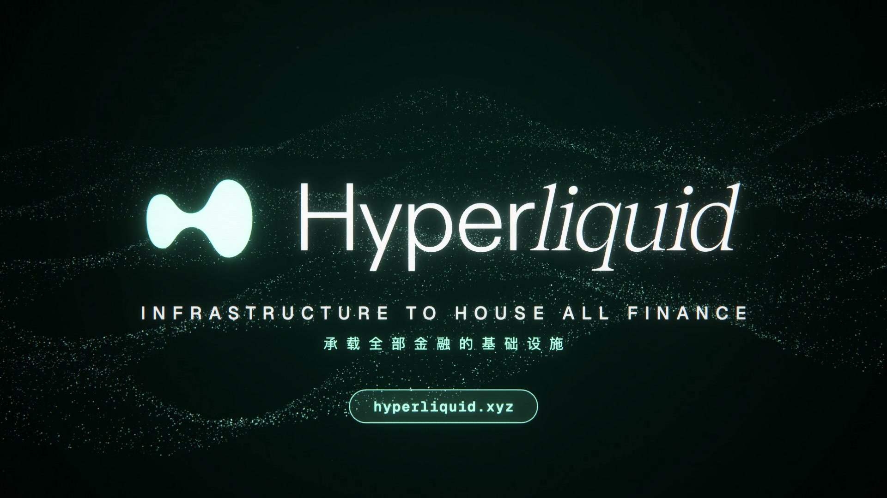

# Hyperliquid 宣传片 · 程序化生成

**中文** | [English](README.en.md)



64 秒 · 1920×1080 · 60 fps · 128 BPM。画面（WebGL + Canvas）和配乐（纯代码合成，无任何采样素材）都由代码生成，两者共用同一份节拍时间表，所有切镜、文字砸入和闪光都卡在鼓点上。

- 预览：[renders/preview_720p.mp4](renders/preview_720p.mp4)（720p，24 MB）
- 1080p60 母版、压缩版和配乐 WAV：见 [Releases](https://github.com/Grivn/hyperliquid-opus-video/releases)

## 目录结构

```
src/
  timeline.js        节拍网格：BPM、小节、场景表、音画共用的事件点
  audio/synth.mjs    配乐合成器 → build/soundtrack.wav + src/generated/events.js
  video/             浏览器渲染器：WebGL 粒子 / 地球 / 后期 + Canvas 2D 场景
  generated/         脚本生成的模块（提交入库，便于离线渲染）：logo.js data.js events.js
scripts/             数据抓取与预处理、逐帧渲染、视频编码
assets/              输入素材：品牌矢量、行情快照、字体（来源与许可见 assets/README.md）
lessons/             音效教程：迷你合成器 + 示例音频
renders/             成片预览与海报
docs/                分镜时间表
build/               （不入库）渲染帧、配乐 WAV、母版视频
```

## 快速开始

需要 Node.js 20+、Google Chrome 和 ffmpeg。在 Apple Silicon 的 macOS 上测试，GPU 走 ANGLE/Metal。

```bash
npm install
npm run build
```

`build` 会依次执行下面四步，整个流程约 10 分钟：

| 命令 | 作用 |
|---|---|
| `npm run prep` | 提取官方 Logo 路径，生成 `src/generated/data.js` |
| `npm run audio` | 合成配乐与鼓点事件 |
| `npm run render` | 无头 Chrome 逐帧渲染 3840 帧到 `build/frames`（每帧 4 个运动模糊子帧） |
| `npm run encode` | 编码母版、压缩版、720p 预览和海报 |

其他命令：

| 命令 | 作用 |
|---|---|
| `npm run fetch-data` | 从 Hyperliquid 公开 API 刷新行情快照（需联网，刷新后画面里的价格会变） |
| `npm run preview` | 启动本地服务，浏览器打开 `/src/video/index.html?play` 实时带声音播放 |
| `npm run check-gpu` | 检查无头 Chrome 的 WebGL2 与 GPU 可用性 |
| `npm run lesson` | 运行音效教程里的迷你合成器 |

调试单帧：`node scripts/render.mjs --frames 7.6s,30.1s --out /tmp/frames`。Chrome 不在默认位置时，设置环境变量 `CHROME_PATH`。

## 技术要点

- 每一帧都是时间的纯函数，任意帧都能独立、并行渲染，结果逐像素可复现。
- WebGL2 层：品牌粒子波带（6.5 万个点）、光速尘埃、点阵地球、网格地面。后期包含 bloom、色差、故障切片、闪光、暗角，以及 4 子帧运动模糊累积。
- Canvas 2D 层：22 个场景的动态排版、真实订单簿与 K 线、等轴测架构图、验证者投票环等。
- 配乐：鼓组、滚动贝斯、超级锯齿和弦与主旋律、pad、琶音、上升音与冲击音；经过 Freeverb 混响、乒乓延迟、侧链、母带均衡和真峰值限幅，响度 -10 LUFS。
- 分镜与时间点见 [docs/storyboard.md](docs/storyboard.md)，音效原理见 [lessons/sound-design](lessons/sound-design/README.md)。

## 素材与数据来源

| 素材 | 来源 |
|---|---|
| Logo 与字标矢量、品牌色 `#97FCE3` / `#03211C`、粒子波浪视觉 | hyperliquid.xyz |
| 文案：Infrastructure to House All Finance、每秒 20 万订单、0.07 秒出块、27 个验证者、无私人投资者、99% 收入进入援助基金 | hyperliquid.xyz、Hyperliquid 官方文档 |
| 行情卡片、走势线、BTC 订单簿 / 成交 / 15 分钟 K 线、HIP-3 市场数量 | `api.hyperliquid.xyz/info`，2026-09-26 快照 |
| 累计交易量 $5.69T、未平仓合约 $16.9B、263 万用户 | Hyperliquid API `globalStats`，2026-09-26 |
| 周交易量历史（2023-06 至 2026-04） | Hyperliquid 官方统计后端 |
| 地球陆地轮廓 | Natural Earth 110m（公有领域） |
| 字体 | Geist、Geist Mono、Instrument Serif（SIL OFL）；中文用系统 PingFang SC |
| 音乐与音效 | `src/audio/synth.mjs` 从零合成 |

## 说明

- Hyperliquid 的名称、标志和品牌视觉归 Hyperliquid 所有，本项目是非官方作品。
- 行情与统计数据是 2026-09-26 的快照，仅作展示，不构成投资建议。

## 许可证

代码以 [MIT 许可证](LICENSE) 发布。第三方素材不在 MIT 授权范围内，遵循各自的许可：

- Hyperliquid 的名称、标志和品牌视觉是 Hyperliquid 的商标。
- 字体遵循 SIL Open Font License。
- 地图数据为公有领域。

逐项来源见 [assets/README.md](assets/README.md)。
